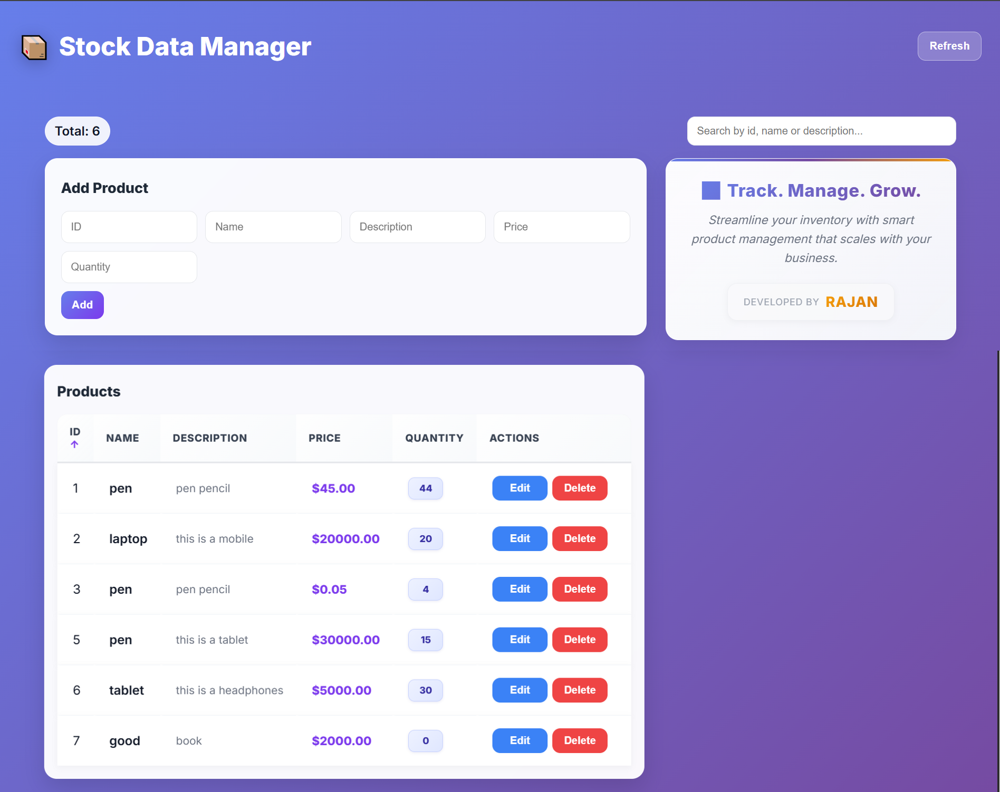
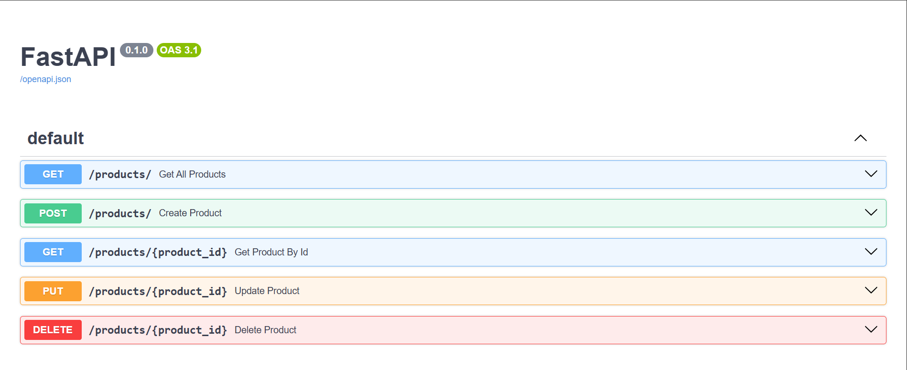

# 📈 Stock Data Management System

    

A Full Stack Stock Data Management Web Application built using **FastAPI**, **React.js**, **PostgreSQL**, and **SQLAlchemy**.

This application allows users to manage stock records with complete CRUD (Create, Read, Update, Delete) operations. Users can add, update, delete, search, and sort stock data through a modern, responsive, and user-friendly interface.

---

## 🚀 Features

- ✅ Add Stock
- ✅ Update Stock
- ✅ Delete Stock
- ✅ Search Stock
- ✅ Sort Data
- ✅ Responsive UI
- ✅ FastAPI REST API
- ✅ PostgreSQL Database
- ✅ React Frontend
- ✅ SQLAlchemy ORM

---

## 🛠 Tech Stack

| Category | Technologies |
|----------|--------------|
| 🎨 Frontend | React.js, Axios, CSS |
| ⚙️ Backend | FastAPI, SQLAlchemy, Pydantic |
| 🗄️ Database | PostgreSQL |
| 💻 Language | Python, JavaScript |
| 🛠 Tools | VS Code, Git, GitHub |

---

## 📂 Project Structure

```
FAST API
│
├── frontend/
│   ├── src/
│   ├── public/
│   └── package.json
│
├── main.py
├── database.py
├── database_models.py
├── models.py
├── requirements.txt
└── README.md
```

---

## ⚙ Installation

### Backend

1. **Create and activate virtual environment:**
   ```bash
   python -m venv project
   project\Scripts\activate.ps1  # Windows PowerShell
   ```

2. **Install dependencies:**
   ```bash
   pip install fastapi uvicorn
   ```

3. **Run the application:**
   ```bash
   uvicorn main:app --reload
   ```

### Frontend

```bash
cd frontend
npm install
npm start
```

---
## API Usage Examples

### Get all products
```bash
curl http://localhost:8000/products/
```

### Get product by ID
```bash
curl http://localhost:8000/products/1
```

### Create a new product
```bash
curl -X POST "http://localhost:8000/products/" \
     -H "Content-Type: application/json" \
     -d '{
       "id": 5,
       "name": "Monitor",
       "description": "4K monitor",
       "price": 299.99,
       "quantity": 15
     }'
```
---
## Models

### Product
- `id`: integer
- `name`: string
- `description`: string
- `price`: float
- `quantity`: integer

## Built With

- [FastAPI](https://fastapi.tiangolo.com/) - Modern, fast web framework for building APIs
- [Pydantic](https://pydantic-docs.helpmanual.io/) - Data validation using Python type hints
- [Uvicorn](https://www.uvicorn.org/) - ASGI server implementation

---
## 📸 Project Preview

### 🏠 Home Page



---

### 📖 FastAPI API Documentation


---


## 👨‍💻 Author

**Rajan Kumar**

🎓 MCA Student

💻 Passionate about Full Stack Web Development

🚀 Built with FastAPI, React.js & PostgreSQL

🌱 Currently learning Backend Development and AI
